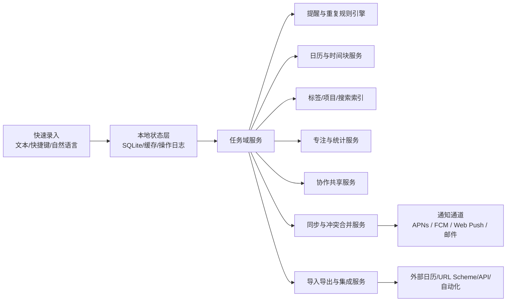
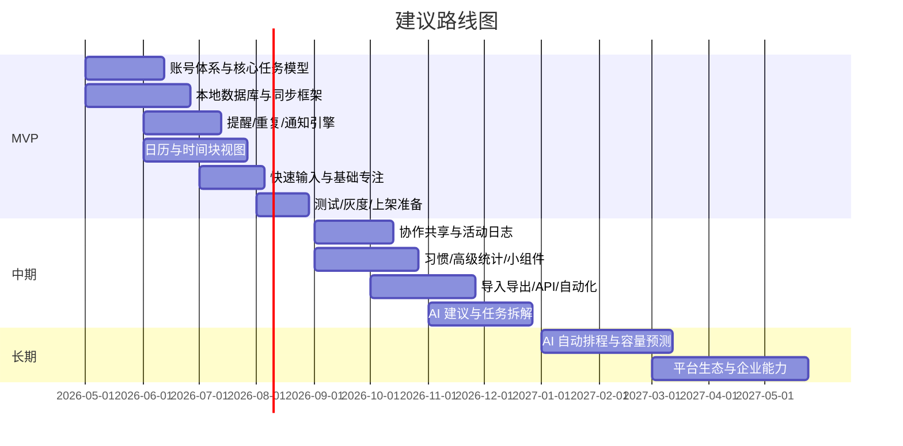

# 专注学习与计划类 App 市场研究与滴答清单深度拆解

## 执行摘要

当前主流“专注学习与计划”产品并不是一个单一品类，而是已经分化出几条清晰路线：以待办与项目为核心的任务管理型，如滴答清单、Todoist、Microsoft To Do、Things 3；以任务与日历时间块融合为核心的日计划型，如 Any.do、Structured、Sunsama；以专注计时、抗分心、学习陪伴为核心的专注型，如 Forest、番茄ToDo；以及以自动排程与容量预测为核心的 AI 规划型，如 Motion。与此同时，像 Notion、Amazing Marvin 这样的通用工作空间/高度可定制产品，正在用“更灵活的数据结构”来覆盖部分计划与学习场景。官方页面显示，市场共性能力已集中到“任务录入、提醒、跨端同步、基础日历、轻协作、移动端体验”，真正拉开差距的则是 AI 排程、专注机制、统计复盘、平台覆盖深度，以及产品对特定人群的适配方式。citeturn12view1turn12view2turn18view2turn26search3turn24view2turn36view1turn22view2turn29search2turn33view0turn35view0

滴答清单在本次样本中最值得重视的点，不是某一个功能“独占”，而是它把“个人效率工具的高频主链路”做成了一个低摩擦、跨平台、价格相对克制的完整组合：任务、项目/清单、标签与过滤、日历视图、提醒与重复、番茄专注、共享协作、桌面快速输入、URL Scheme / Integrations、开发者入口、隐私与安全资源，都已经有公开外显能力。换句话说，滴答清单更像“个人效率超集”而不是单纯的待办清单。相对地，Todoist 的强项是任务表达与集成生态，Things 3 的强项是 Apple-only 的高完成度体验，Sunsama 的强项是引导式日计划与时间盒，Motion 的强项是 AI 自动排程与项目容量管理，Structured、Forest、番茄ToDo 的强项则集中在时间可视化、抗分心与学习场景。citeturn1view0turn9view2turn0search4turn8search17turn14view3turn15view0turn36view3turn22view3turn22view4turn25view0turn29search2turn33view0

如果目标是做一款“可执行、可落地、可上线”的竞品，最重要的结论不是“先把所有功能做满”，而是“先把主链路做稳”。这条主链路包括：可靠的任务模型、稳定的提醒与重复规则、好用的日历/时间块、离线优先同步、基础专注计时。协作、习惯、开放 API、深度自动化、AI 智能排程都值得做，但不应挤进首版。原因很简单：真正决定留存与口碑的，通常不是宣传页上最炫的功能，而是“记下一件事能不能秒存”“提醒会不会准时到”“跨设备会不会乱”“拖动日历是否顺手”“网络差时还能不能继续用”。这也是本报告在路线图中把同步、提醒、重复规则、日历、专注计时放在 MVP 前列的核心原因。

| 关键结论 | 对产品与工程的直接含义 |
|---|---|
| 滴答清单的优势是“广而稳”，不是“极端前沿” | 竞品不能只做番茄钟或只做待办；至少要在任务、提醒、时间视图三个面同时成立 |
| 市场已经从“列清单”转向“管理注意力与日程执行” | 日历时间块、专注模式、低打断通知与复盘统计应视为核心，而非装饰功能 |
| AI 是差异化增强层，不是基础层 | 首版先做规则与数据模型；中后期再叠加自然语言、建议排程、容量预测 |
| 学生场景与专业人士场景的最佳解不同 | 学生更看重专注、锁机、白名单、自习室与低价；职场用户更看重日历整合、协作、自动化 |

## 主流产品列表表格

下表按 2026-04-23 可访问的官网、官方定价页与应用商店公开信息整理。部分产品明确说明价格会随地区、币种和计费渠道变化，因此表内优先记录官网美元价或商店公开价；对公开定价不透明的产品，直接标注“免费下载+内购”而不强行推断。citeturn24view0turn15view0turn36view0

| 产品 | 定位 | 目标用户 | 商业模式 | 平台支持 | 定价策略 | 主要依据 |
|---|---|---|---|---|---|---|
| 滴答清单 TickTick | 个人效率“超集”：任务、日历、专注、协作、轻习惯 | 学生、知识工作者、小团队 | Freemium | iOS / Android / Web / Windows / macOS | 免费；Premium 公开页显示 $3.99/月或 $35.99/年 | citeturn1view0turn9view2turn0search4 |
| Todoist | 轻量任务管理，强调结构清晰、集成与团队协作 | 个人、多项目管理者、小团队 | Freemium + Pro/Business | iOS / Android / Web / Windows / macOS | 免费；Pro $7/月或 $60/年；Business $10/人/月或 $96/人/年 | citeturn12view1turn12view0turn15view0turn15view1 |
| **entity["company","Microsoft","software company"] To Do** | 轻量待办 + My Day + Outlook 任务整合 | 个人用户、学生、Microsoft 生态用户 | 免费 | iOS / Android / Web / Windows / macOS | 免费 | citeturn12view2turn37search0turn37search4turn37search5 |
| Any.do | 一体化个人/家庭/团队计划：任务、日历、提醒、家庭空间 | 个人、家庭、轻协作团队 | Freemium + Premium/Family/Teams | iOS / Android / Web / Windows / macOS | 免费；Premium $4.99/月年付或 $7.99/月；Family $8.33/月（4人，年付）；Teams $4.99/成员/月（年付） | citeturn19view0turn18view2turn17search11turn17search15 |
| **entity["company","Notion","workspace software"]** | 文档 + 数据库 + 任务 + 日历的工作空间 | 学生、个人、内容/项目型团队 | Freemium + seat-based paid tiers | iOS / Android / Web / Windows / macOS | Free $0；Plus $10/席/月；Business $20/席/月；Enterprise 定制 | citeturn12view4turn12view5turn13view1turn13view2turn13view4 |
| Things 3 | 高完成度个人任务管理，偏 GTD 与日程预览 | 追求极简与质感的个人用户；仅 **entity["company","Apple","consumer tech company"]** 生态 | 一次性买断，按设备付费 | iOS / iPadOS / macOS；无 Android / 无 Web | iPhone $9.99；iPad $19.99；Mac $49.99；分别购买 | citeturn26search3turn28search13turn28search4turn27search13turn28search3 |
| Structured | 可视化时间轴日计划，强调时间块与 ADHD 友好 | 学生、时间块用户、ADHD 用户 | 免费 + Pro 订阅/买断 | iOS / Android / Web / macOS | 免费；Pro $6.99/月、$29.99/年、$99.99 终身 | citeturn23search0turn24view1turn24view2turn24view3turn25view0 |
| Sunsama | 引导式日计划 + 时间盒 + 多工具聚合 | 专业人士、创始人、产品/设计/运营角色 | 试用后付费，按人收费 | iOS / Android / Web / macOS / Windows / Linux | 14 天试用；$25/人/月，或 $20/人/月（年付） | citeturn36view1turn36view0turn36view2turn36view3 |
| Motion | AI 自动排程 + 任务/项目管理 + 容量预测 | 独立专业人士、管理者、团队 | 试用后付费、seat-based | iOS / Android / Web / macOS / Windows | 官网当前年付视图显示 Pro AI $19/席/月；先试用后付费 | citeturn22view2turn22view3turn22view4turn22view1turn22view0 |
| Forest | 游戏化专注计时与抗手机分心 | 学生、专注训练用户 | 免费下载 + 内购/订阅 | iOS / Android / 浏览器扩展；无完整 Web 工作台 | 免费下载；美区页面公开显示有月/年内购与道具内购 | citeturn29search2turn29search0turn29search6turn30search1turn30search4 |
| 番茄ToDo | 学习导向的专注番茄钟 + 待办 + 习惯 + 自习室 | 中学生、大学生、考研/考证人群 | 免费下载 + 内购会员 | iOS / iPadOS / 手表端已官方确认；Android 版公开官网落地页不透明 | 免费 + 内购；公开页未给出统一官方标准价 | citeturn33view0turn32search2 |
| Amazing Marvin | 高度可定制的个人任务系统，偏 ADHD/高阶自定义 | ADHD 用户、重度效率用户、方法论玩家 | 14 天试用后付费 | iOS / Android / Web / Windows / macOS / Linux | $8/月（按年付，$96/年）；无免费计划 | citeturn35view0turn35view1turn34search3turn20search1 |

## 滴答清单功能模块详表

滴答清单的公开外显轮廓，已经能从官方功能页、平台页、价格页、开发者入口、隐私政策和资源入口拼出一个相当完整的产品边界：它在 Windows 页面明确展示了快速录入、日历视图、协作、Pomo Timer、桌面组件，并在页脚直接暴露 Help Center、FAQ、URL Scheme、Integrations、Security；官网另有 Premium 与 Developer 入口，隐私政策则披露了账号信息、用户内容、设备信息以及 AI 相关交互内容的处理范围。需要说明的是，下表中的“推荐关键数据结构 / 必要后端服务 / 建议第三方依赖 / 性能要求”并不是声称这些就是滴答清单的真实内部实现，而是基于其已公开能力倒推出的“若要做出同等体验，工程上至少需要什么”。citeturn9view2turn0search4turn8search17turn6view0

| 模块与子模块 | 官方可见能力 | 核心交互流程 | 推荐关键数据结构 | 必要后端服务 | 建议第三方依赖 | 性能 / 可用性要求 | 安全与隐私考虑 | 官方依据 |
|---|---|---|---|---|---|---|---|---|
| 任务管理：任务、子任务、备注、优先级、附件、完成态 | 任务是产品主对象；支持快速添加、编辑、组织与跨端处理 | 快速录入 → 解析字段 → 本地创建 → 服务端确认 → 完成/延期/归档 | `Task{id,title,notes,status,priority,list_id,parent_id,checklist[],attachments[],start_at,due_at,duration_min,created_by,updated_at}` | Task CRUD、全文搜索、字段验证、冲突合并、附件元数据服务 | 对象存储、OCR/文件预览可延后、系统分享扩展 | 本地保存应接近即时；列表滚动 60fps；500~2000 任务仍可顺滑筛选 | 任务正文、附件、备注都属于高敏感个人内容；需传输加密、最小权限、导出删除能力 | citeturn1view0turn9view2 |
| 标签 / 项目 / 清单 / 文件夹 / 智能清单 | 支持多维分类与视图；这是从“记事”迈向“系统管理”的关键层 | 任务关联 list/tag/filter → 视图切换 → 批量操作 → 智能规则回显结果 | `List{id,name,type,owner_id}`、`Tag{id,name,color}`、`Filter{id,expr,scope}`、`TaskTag{task_id,tag_id}` | 过滤表达式解析、索引、批处理、排序策略、权限校验 | 搜索引擎可选；规则表达式库 | 过滤结果 p95 < 300ms；批量移动/标记幂等 | 共享列表中的标签与筛选需注意权限隔离，避免跨清单泄露 | citeturn1view0 |
| 日历：月/周/日视图、拖拽改期、时间块 | Windows 页面明确强调“Powerful calendar views”和拖拽管理 | 任务带日期/时长 → 进入日历 → 拖拽到时间块 → 回写任务 → 推送提醒 | `CalendarItem{id,task_id,start_at,end_at,all_day,timezone,source}` | 日历聚合、时区换算、拖拽回写、冲突校验、外部日历同步 | 系统日历读写、ICS/CalDAV/外部日历订阅可后接 | 拖拽反馈 < 100ms；时区切换与 DST 不错位；大月视图渲染稳定 | 日历接入往往需要读取完整行程，权限提示必须解释用途 | citeturn9view2turn1view0 |
| 提醒 / 重复规则：到点提醒、自定义重复、截止前提醒 | 这是待办产品的“可靠性内核” | 设置 due/start/reminder → 写入规则引擎 → 生成未来实例或 next fire time → 下发通知 → 延期/完成后重算 | `Reminder{id,task_id,trigger_at,channel,state}`、`RecurrenceRule{rrule,timezone,until,count,exceptions[]}` | 调度器、重复规则引擎、通知编排、节流、失败重试 | APNs、FCM、Web Push、邮件/SMS 可选 | 提醒误差尽量控制在 ±30s；重复规则要覆盖月底、闰年、跨时区 | 通知文本可能在锁屏暴露隐私，需支持隐藏内容与静默时段 | citeturn1view0 |
| 专注 / 番茄 / 白噪音 / 统计 | Windows 页面直接展示内置 Pomo Timer；专注是滴答清单区别于纯待办的重要层 | 选择任务 → 开始番茄 → 计时中更新状态 → 完成后写入统计 → 可选休息/白噪音 → 汇总日报周报 | `FocusSession{id,task_id,start_at,end_at,duration_min,session_type,noise_id,device_id}` | 计时状态同步、前后台保活、专注统计聚合、成就/报表 | 音频播放、前台服务、锁屏/实时活动组件 | 前后台切换不中断；多端同时开计时要有冲突策略；报表秒开 | 专注与行为统计是行为数据，需明示用途并允许关闭/删除 | citeturn9view2turn1view0 |
| 习惯 / 长期追踪 / 复盘 | 官方功能页将习惯与持续追踪列为产品层能力之一 | 新建 habit → 定义频率/目标 → 每日打卡 → 形成 streak/图表 → 进入周/月复盘 | `Habit{id,name,goal_type,target_value,frequency,streak}`、`HabitLog{habit_id,date,value,status}` | Habit 调度、连续天数计算、图表聚合、异常修复 | 图表库、系统健康平台接入可选 | streak 计算要幂等；跨时区切换不能误断签 | 习惯和健康/专注数据叠加后敏感度更高；默认最小化采集 | citeturn1view0 |
| 协作 / 共享：共享清单、指派、评论、活动 | Windows 页面直接展示 “Collaborate with anyone” | 创建共享空间 → 邀请成员 → 分配任务 / 评论 / 变更状态 → 活动流回放 | `Workspace{id,owner_id}`、`Membership{user_id,role}`、`Comment{id,task_id,author_id,body}`、`Activity{id,entity,action}` | 邀请与权限、评论流、审计日志、通知订阅、成员管理 | 邮件邀请、团队登录、头像/文件存储 | 协作变更应在数秒内对全员可见；活动日志要可回放 | 最重要的是权限边界：共享不应穿透到私人清单与私密标签 | citeturn9view2 |
| 智能建议 / 快速输入 / 自然语言识别 | 官方页与平台页都强调“Add task faster”；资源页已有 MCP/开发者方向迹象 | 用户输入“明天 3 点交报告” → 解析标题/时间/清单/时长 → 预填表单 → 用户确认 → 写入任务 | `QuickAddDraft{text,parsed_fields,confidence}`、`NLPParseResult{title,due_at,tags,priority}` | 自然语言解析、规则引擎、解析回显、纠错日志 | 日期解析库、AI/NLP 服务可选；MCP/Agent 接口可中后期接入 | 解析需“可解释可改写”；错误时不能直接覆盖用户原文 | 若引入大模型，应避免把敏感任务内容无控制地发送到第三方 | citeturn9view2turn8search5turn8search17 |
| 同步 / 离线 / 跨端一致性 | TickTick 的核心卖点之一就是多端；平台页和产品页都围绕跨端组织内容 | 本地操作写入 op-log → 立即更新 UI → 联机后增量同步 → 服务端排序归并 → 客户端确认 | `OpLog{id,entity_id,op_type,payload,client_ts,base_version}`、`SyncCursor`、`ConflictRecord` | Sync Gateway、版本控制、冲突解决、设备状态、增量订阅 | 本地数据库、长连接/轮询、对象缓存 | 离线必须可创建/完成/延期任务；同步 p95 < 2s；弱网可重试 | 同步过程中的缓存、日志、离线数据均需本地加固与账号隔离 | citeturn9view2turn6view0 |
| 通知 / 桌面组件 / 快捷入口 / URL Scheme | Windows 页面明确写到快捷键快速录入、桌面组件；资源栏有 URL Scheme | 快捷键/分享入口/桌面挂件 → 新建或显示今日清单 → 快速完成/稍后提醒 | `ShortcutAction`、`WidgetConfig`、`DeepLinkIntent` | 快捷入口解析、轻量缓存、深链路由、通知中心联动 | 系统桌面组件、分享扩展、URL Scheme / Universal Link | 入口层必须秒开；不能因登录状态/冷启动导致丢动作 | 快捷入口常会绕过完整页面，必须加强输入校验和会话校验 | citeturn9view2 |
| 数据导入导出 / API / 第三方集成 | 资源区直接暴露 Integrations、URL Scheme，且已有 Developer 入口 | 选择迁移来源/授权 → 拉取任务映射 → 预览 → 导入 → 生成日志；或第三方经 API / URL Scheme 写入 | `ImportJob{id,source,status,mapping}`、`ExportJob{id,format,scope}`、`AccessToken{id,scope}` | OAuth、连接器、队列、幂等导入、审计、限流 | 外部任务/日历/自动化平台、Webhook、开放 API | 导入必须可回滚或至少可审计；导出要完整且可验证 | 第三方授权要精细到 scope；令牌可撤销、可审计、可过期 | citeturn9view2turn8search17 |
| 隐私 / 权限 / UI-UX 要素 | 官方隐私政策已覆盖账号、内容、设备数据与 AI 相关交互；UI 层持续强调低摩擦快速录入与拖拽 | 注册/登录 → 权限授权 → 使用任务/提醒/日历/通知 → 查看或撤回权限 → 导出/删除数据 | `ConsentLog{id,user_id,permission,granted_at}`、`PrivacySetting{lockscreen_preview,analytics_opt_in}` | 账号、审计、导出删除、权限记录、偏好设置、A/B 测试可选 | 通知、日历、位置、音频、系统分享、崩溃抓取 | 权限弹窗要延迟到必要时机；关键路径要少点一次、少等一秒 | 锁屏内容隐藏、最小化采集、提供可见的数据控制面板与删除流程 | citeturn6view0turn9view2 |

把上表压缩成一句产品判断：滴答清单最难复制的并不是“番茄钟”或“日历”，而是“这些模块已经被打磨成一个相对统一的数据与交互系统”。这意味着竞品如果只拷贝表面功能，很容易做出“功能很多但链路断裂”的产品；相反，真正应该复制的是它的对象模型完整度、入口一致性和跨端可靠性。

## 竞品功能对比表

下表采用统一口径比较：`✓` 表示原生强支持，`△` 表示部分支持、较弱支持或依赖集成，`—` 表示不是主路径。最后一列单独标出每个产品最值得关注的差异化亮点，便于后续确定你的产品到底要走“全能型”“专注型”“引导型”还是“AI 排程型”。表中结论均以官方资料为主。  

| 产品 | 任务层级 | 日历 / 时间块 | 提醒 / 重复 | 专注 / 番茄 | 协作 / 共享 | AI / 智能规划 | API / 深集成 | 习惯 / 统计 | 差异化亮点 | 主要依据 |
|---|---|---|---|---|---|---|---|---|---|---|
| 滴答清单 | ✓ | ✓ | ✓ | ✓ | ✓ | △ | ✓ | ✓ | 以较低订阅价覆盖“任务+日历+专注+共享+跨端”的完整个人效率面 | citeturn1view0turn9view2turn0search4turn8search17 |
| Todoist | ✓ | △ | ✓ | △ | ✓ | △ | ✓ | △ | 任务表达简洁、团队清晰、90+ integrations 与开发者生态成熟 | citeturn14view3turn12view1turn15view0turn15view1 |
| Microsoft To Do | ✓ | △ | ✓ | — | △ | △ | △ | — | 免费、My Day 建议强、与 Outlook/Planner 生态衔接自然 | citeturn12view2turn37search5turn37search6 |
| Any.do | ✓ | ✓ | ✓ | △ | ✓ | △ | ✓ | △ | 家庭空间、WhatsApp 提醒、位置提醒，对家庭/生活场景更友好 | citeturn19view0turn18view1turn18view2turn17search15 |
| Notion | ✓ | △ | △ | — | ✓ | ✓ | ✓ | △ | 文档、数据库、任务、AI 与 Calendar 能在一个工作空间中组合 | citeturn12view4turn12view5turn13view2 |
| Things 3 | ✓ | △ | ✓ | — | — | — | △ | — | Apple-only 的交互完成度与审美，是“高溢价个人任务管理”代表 | citeturn26search3turn28search3turn28search13turn28search4turn27search13 |
| Structured | ✓ | ✓ | △ | △ | — | △ | △ | △ | 视觉时间轴极强，适合 ADHD 与“把一天看见”的用户 | citeturn25view0turn24view2turn24view3 |
| Sunsama | △ | ✓ | △ | △ | △ | △ | ✓ | ✓ | 引导式日计划、时间盒、周计划与多工具聚合，是“方法论型”产品 | citeturn36view3turn36view1turn36view0 |
| Motion | ✓ | ✓ | ✓ | — | ✓ | ✓ | △ | △ | AI 自动排程、风险提醒、容量预测，是 AI 规划路线代表 | citeturn22view2turn22view3turn22view4turn22view0 |
| Forest | — | — | — | ✓ | — | — | △ | ✓ | 游戏化抗分心与“种树”反馈最强，学习专注场景心智最清晰 | citeturn29search2turn29search0turn29search6turn30search4 |
| 番茄ToDo | △ | — | ✓ | ✓ | △ | — | — | ✓ | 学霸模式、白名单/拦截、自习室、热力图与学习性复盘非常强 | citeturn33view0turn32search2 |
| Amazing Marvin | ✓ | ✓ | ✓ | ✓ | — | — | ✓ | ✓ | 100+ 特性可自由开关，极度可定制，适合高阶效率方法实践者 | citeturn35view0turn35view1turn20search1 |

对滴答清单最有参照意义的，不是所有竞品，而是四类代表：Todoist 代表“结构清晰 + API/集成优先”，Things 3 代表“单平台深体验”，Sunsama 代表“引导式日计划”，Motion 代表“AI 自动排程”，Structured/Forest/番茄ToDo 则分别代表“时间可视化”“游戏化抗分心”“学习场景刚需”。如果你准备做一款新产品，最先要做的战略判断不是“功能抄谁”，而是“我要争夺哪条心智”。citeturn14view3turn28search3turn36view3turn22view3turn25view0turn29search2turn33view0

## 功能实现计划与路线图

在“预算、团队规模、目标平台优先级均无特定约束”的前提下，更可行的做法不是给出唯一方案，而是给出三套可选路径：

| 路径 | 目标用户 | 平台优先级 | 适合情况 | 风险 |
|---|---|---|---|---|
| 学生场景优先 | 中学/大学/考研/考证 | Android → iOS → Web 辅助 | 追求更低获客成本、强调专注/锁机/统计 | 任务协作和桌面场景较弱，国际化难度更高 |
| 平衡跨端优先 | 大众效率用户 | iOS + Android + Web 同步起步 | 最接近滴答清单的主流路线 | 同步、通知、测试矩阵工作量最大 |
| 桌面办公优先 | 知识工作者、小团队 | Web / macOS / Windows → 移动补齐 | 更容易做时间块、协作、导入与集成 | 学生场景和移动留存可能不如移动优先路线 |

下面给出一份“以平衡跨端优先”为基线的功能计划。人力与时间按**产品经理 + 设计 + 前端客户端 + 后端 + QA + 运维/DevOps**的标准产品团队估算；为了便于比较，以**人月**而不是货币预算表示。

| 功能 | 阶段 | 优先级 | 复杂度 | 预估人月 | 主要角色 | 说明 |
|---|---|---|---|---:|---|---|
| 账号体系、设备管理、基础权限 | MVP | P0 | 中 | 1.5 | 后端/客户端/QA | 支撑跨端与离线同步的前提 |
| 任务 CRUD、子任务、备注、优先级、完成态 | MVP | P0 | 高 | 3.0 | 客户端/后端/QA | 产品核心对象；决定后续一切能力 |
| 清单/文件夹/标签/基础筛选 | MVP | P0 | 中 | 2.0 | 客户端/后端 | 让“任务数量增加后仍然可管理” |
| 提醒与基础重复规则 | MVP | P0 | 高 | 3.0 | 后端/客户端/QA | 最容易拖慢项目的隐形复杂度之一 |
| 日历视图与时间块拖拽 | MVP | P0 | 高 | 3.0 | 客户端/设计/后端 | 这是从“待办”跃迁到“计划”的关键 |
| 本地数据库、离线优先、增量同步 | MVP | P0 | 高 | 4.0 | 客户端/后端/DevOps | 可靠性与口碑核心；不建议省略 |
| 推送通知与前后台保活策略 | MVP | P0 | 高 | 2.0 | 后端/客户端 | 与提醒引擎一起构成“准时交付” |
| 快速输入、自然语言轻解析 | MVP | P1 | 中 | 1.5 | 客户端/后端 | 先做规则解析，不急于上大模型 |
| 基础番茄计时、专注统计、日报 | MVP | P1 | 中 | 1.5 | 客户端/后端 | 学生与个人效率场景的留存抓手 |
| 主题、组件、设置、基础无障碍 | MVP | P1 | 中 | 1.5 | 设计/客户端 | 保证可用性、适配度和首版口碑 |
| 协作共享、评论、指派、活动日志 | 中期 | P1 | 高 | 4.0 | 后端/客户端/QA | 当产品转向团队与家庭场景时必做 |
| 习惯模块与高级统计复盘 | 中期 | P2 | 中 | 2.5 | 客户端/后端/数据 | 能增强每日打开率，但不宜首版塞入 |
| 桌面组件、手表端、位置提醒、白名单/锁模式 | 中期 | P2 | 中-高 | 3.0 | 客户端 | 适合差异化，但平台碎片化明显 |
| 导入导出、开放 API、自动化连接器 | 中期 | P1 | 高 | 4.0 | 后端/DevOps | 这是进入“工具生态”阶段的门槛 |
| AI 智能建议、任务拆解、日程建议 | 中期 | P2 | 高 | 5.0 | 后端/数据/产品 | 先做 assistant，不要先做 agent |
| AI 自动排程、容量预测、团队视图 | 长期 | P2 | 高 | 6.0 | 后端/数据/前端 | 这一步才真正接近 Motion 类路线 |
| 市场/模板/插件生态 | 长期 | P3 | 高 | 5.0 | 平台/后端/运营 | 面向平台期；非早期必要项 |
| 合规审计、企业权限、SAML/SCIM | 长期 | P3 | 高 | 3.0 | 后端/安全/DevOps | 只有明确进入 B2B 才建议投入 |

按上表估算，**MVP 总量约 22–24 人月**，中期迭代约 **13–18 人月**，长期差异化约 **14–20 人月**。如果团队是 4–5 人全职小队，MVP 更现实的周期大概是 **6–8 个月**；如果是 7–9 人的平衡团队，MVP 可压缩到 **4–5 个月**；如果是 10–12 人并行推进的高配团队，理论上可做 **3–4 个月**，但组织成本和测试矩阵会明显上升。

把提醒、低打断通知、时间块和清晰计划放进 MVP 前列，不只是工程经验问题，也有研究依据：通知造成的任务打断会增加压力并损害表现，因此早期产品应优先做“可靠且克制”的通知系统；而 implementation intentions 与更高质量的计划提示，会显著提高执行率，尤其对原本较弱的计划者更有效；时间块方法也强调现实工作量和缓冲区，不能把日历填满；番茄法则更适合作为可调节的专注模式，而不是一刀切的默认。citeturn38search1turn38search8turn38search10turn38search14turn38search3turn38search2

## 关键技术与实施建议要点

最稳妥的技术路线，不是上来就把系统拆成很多微服务，而是**先做模块化单体 + 明确领域边界**。对这类产品而言，真正复杂的对象不是“用户”而是“任务及其衍生事件”：任务、提醒、重复规则、日历实例、专注 session、同步版本、协作活动、导入映射，这些对象天然高耦合。如果首版就微服务化，团队会先死在分布式事务、调试链路和版本管理上；更好的方式是：**一个主后端进程内拆 domain module**，清楚分开 Task、Reminder、Calendar、Sync、Collaboration、Integration、Analytics 七个域，等到有明确瓶颈再拆。  

在前端栈上，若目标是“多端速度优先”，推荐 **Flutter + React/Next.js** 的组合：Flutter 负责 iOS/Android 的绝大部分共享 UI 与状态管理，Web 用 React/Next.js 做营销页、管理后台和桌面浏览器工作台；若团队更偏 JavaScript，**React Native + React Web** 也可行，但在复杂日历与高一致交互上，往往需要更谨慎地处理性能与平台差异。若你的核心卖点明确是“桌面/Apple 级体验”，则可以考虑 iOS/macOS 原生优先，但这条路线研发成本会显著上升。

在数据层，首版建议以 **PostgreSQL + Redis + 对象存储 + 本地 SQLite** 为主：PostgreSQL 做权威事务库；Redis 做会话、幂等键与热点缓存；对象存储放附件；客户端本地 SQLite 做离线优先与操作日志。如果日历检索、全文搜索和筛选表达式开始成为瓶颈，再补 **OpenSearch**；如果后期要做复盘、热力图、时长分析、团队容量报表，再补 **ClickHouse / BigQuery** 一类分析库。这样可以避免在 MVP 阶段引入不必要的基础设施复杂度。

通知系统必须被视为独立于“任务 CRUD”的一等公民。推荐做成三层：**硬提醒**（截止/约定时刻，必须到）、**建议提醒**（例如今日计划开始前的温和提醒）、**汇总提醒**（晚间复盘、早晨计划 digest）。研究显示，减少通知引发的打断有利于提升表现并降低压力，而频繁中断本身会带来更高的时间压力和应激，因此默认策略不应把所有状态变化都推给用户；应提供静默时段、批量汇总、升级策略和锁屏内容隐藏。citeturn38search1turn38search8

计划页的交互建议从第一天就支持“**标题 + 何时 + 做多久 + 如果/那么触发**”四件事，而不只是一个文本框。换句话说，应让产品天然支持 implementation intentions。例如，用户输入“晚上 8 点复习高数 40 分钟，若被打断则顺延到 9 点”时，系统能把它拆成明确的执行意图，而不是只存一条模糊待办。研究与教育实践都表明：清晰计划、高质量计划提示以及保留缓冲时间，会比只列清单更能提高执行率。citeturn38search14turn38search10turn38search3

对“离线同步”，首版并不需要上 CRDT。对任务型对象，**本地操作日志 + 版本号/时间戳 + 服务端 canonical merge** 就足够好：本地先写 op-log 并立即渲染，联机后做增量同步；冲突优先按字段级别而不是整对象覆盖；评论流和协作活动要保证 append-only；真正需要 CRDT 的，往往是多人同时编辑长文档，而不是待办/提醒/标记完成。把复杂度收在“对象粒度和幂等规则”而不是“通用冲突算法”上，会更适合滴答清单这类产品。

“AI” 最适合放在三个位置，而不是全系统乱撒：**自然语言解析**、**任务拆解/总结**、**排程建议**。首版不建议让 AI 直接成为系统真相来源；它应该生成 suggestion，而不是直接改写任务对象。原因很现实：任务、提醒、截止、共享权限、重复规则这些对象都要求高度确定性，可解释、可审计、可回滚，远比“像聊天机器人一样聪明”更重要。

最后是测试与上线验收。对这类产品，最容易被低估的不是 UI，而是“规则和边界条件”。上线前至少要建立一套覆盖以下类型的验收门槛：

| 验收项 | 建议门槛 |
|---|---|
| 冷启动性能 | 中档机型冷启动 < 2s；任务列表首屏可交互 < 1s |
| 本地操作延迟 | 新建 / 完成 / 延期任务本地反馈 < 150ms |
| 跨端同步 | 常规网络下 p95 < 2s；断网恢复后不丢操作 |
| 提醒可靠性 | 关键提醒到达率 > 98%；时区 / DST 回归用例全通过 |
| 重复规则正确性 | 至少覆盖 200+ 规则测试：月底、闰年、工作日、例外日期、跨月顺延 |
| 日历交互 | 拖拽时间块无跳动、不卡顿；大月视图与周视图状态一致 |
| 稳定性 | Crash-free sessions > 99.5% |
| 隐私合规 | 账号注销、数据导出、数据删除、权限撤回路径均可验证 |
| 可观测性 | 同步、提醒、推送、导入导出全链路可追踪；错误可按用户与设备定位 |
| 灰度发布 | 支持 feature flag、按平台分批放量、紧急开关与回滚 |

如果把整份报告压缩成一句实施建议，那就是：**先做“可信赖的执行系统”，再做“聪明的规划系统”**。滴答清单之所以强，不在于它同时有很多模块，而在于这些模块已经围绕“任务对象 + 时间对象 + 同步对象”形成了统一体验。新产品若想赢，不必首版做得更全，但必须在某条心智上比它更强：要么更懂学习专注，要么更懂日计划引导，要么更懂 AI 自动排程，要么更懂某个特定平台的体验。